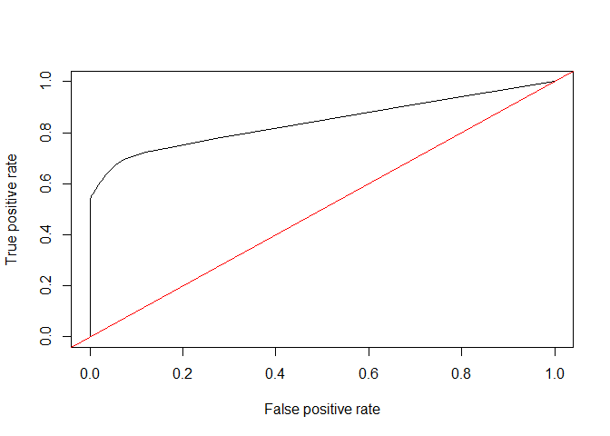

fraud
================

    ##   user_id         signup_time       purchase_time purchase_value     device_id
    ## 1   22058 2015-02-24 22:55:49 2015-04-18 02:47:11             34 QVPSPJUOCKZAR
    ## 2  333320 2015-06-07 20:39:50 2015-06-08 01:38:54             16 EOGFQPIZPYXFZ
    ## 3    1359 2015-01-01 18:52:44 2015-01-01 18:52:45             15 YSSKYOSJHPPLJ
    ## 4  150084 2015-04-28 21:13:25 2015-05-04 13:54:50             44 ATGTXKYKUDUQN
    ## 5  221365 2015-07-21 07:09:52 2015-09-09 18:40:53             39 NAUITBZFJKHWW
    ## 6  159135 2015-05-21 06:03:03 2015-07-09 08:05:14             42 ALEYXFXINSXLZ
    ##   source browser sex age ip_address class
    ## 1    SEO  Chrome   M  39  732758369     0
    ## 2    Ads  Chrome   F  53  350311388     0
    ## 3    SEO   Opera   M  53 2621473820     1
    ## 4    SEO  Safari   M  41 3840542444     0
    ## 5    Ads  Safari   M  45  415583117     0
    ## 6    Ads  Chrome   M  18 2809315200     0

    ##   lower_bound_ip_address upper_bound_ip_address   country
    ## 1               16777216               16777471 Australia
    ## 2               16777472               16777727     China
    ## 3               16777728               16778239     China
    ## 4               16778240               16779263 Australia
    ## 5               16779264               16781311     China
    ## 6               16781312               16785407     Japan

## Find the country of each ip address in the data table.

Summarize the users population by countries:

    ## # A tibble: 10 x 2
    ## # Groups:   country [10]
    ##    country               n
    ##    <chr>             <int>
    ##  1 United States     58049
    ##  2 Not Found         21966
    ##  3 China             12038
    ##  4 Japan              7306
    ##  5 United Kingdom     4490
    ##  6 Korea Republic of  4162
    ##  7 Germany            3646
    ##  8 France             3161
    ##  9 Canada             2975
    ## 10 Brazil             2961

## Feature Engineering

### Get time difference between sign-up time and purchase time

### Get number of users with the same device id

### Get number of users with the same ip address

## Build the model

    ## Loading required package: randomForest

    ## randomForest 4.6-14

    ## Type rfNews() to see new features/changes/bug fixes.

    ## 
    ## Attaching package: 'randomForest'

    ## The following object is masked from 'package:dplyr':
    ## 
    ##     combine

    ## The following object is masked from 'package:ggplot2':
    ## 
    ##     margin

    ## 
    ## Call:
    ##  randomForest(x = train_data[, -7], y = train_data$class, xtest = test_data[,      -7], ytest = test_data$class, ntree = 50, mtry = 3, keep.forest = TRUE) 
    ##                Type of random forest: classification
    ##                      Number of trees: 50
    ## No. of variables tried at each split: 3
    ## 
    ##         OOB estimate of  error rate: 4.56%
    ## Confusion matrix:
    ##       0    1 class.error
    ## 0 90028  342 0.003784442
    ## 1  4209 5154 0.449535405
    ##                 Test set error rate: 4.42%
    ## Confusion matrix:
    ##       0    1 class.error
    ## 0 46494   97 0.002081947
    ## 1  2172 2616 0.453634085

## Use ROC to see if we need to change cutoff points

As we care most about maximizing the true positive rate, we can use the
approach of maximizing true positive rate - false positive rate.

    ## Loading required package: ROCR

<!-- -->

    ## integer(0)

    ##    cutoff   fn_rate    fp_rate
    ## 35   0.14 0.3061821 0.07314717

Using the selected cutoff value, we will get 70% true positive rate and
6% false positive rate.
